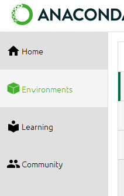
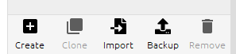
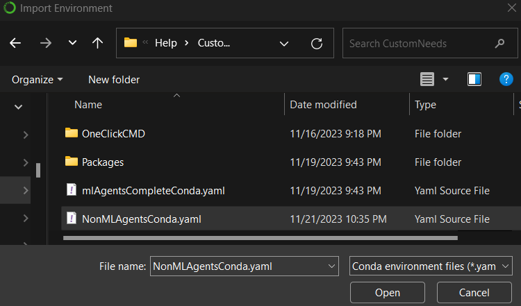
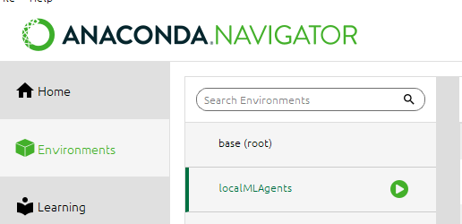
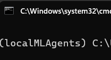
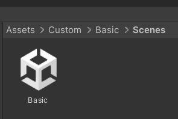

# ML_Agents_Examples
---

The initial purpose of this repository is to create a stable working project for ML-Agents 3. There were a lot of installation files, so I thought of making this process less hassle.
 
>Only tested and aimed for Windows 11. Might work for Win 10.

The Unity version used : 2022.3.12f1. You should be able use any 2022.3.12f1+

ML-Agents Branch focus :

```markdown
[release-21-branch](https://github.com/Unity-Technologies/ml-agents/tree/release-21-branch)
```

|        **Version**         | **Release Date** | **Source** | **Documentation** | **Download** | **Python Package** | **Unity Package** |
|:--------------------------:|:------:|:-------------:|:-------:|:------------:|:------------:|:------------:|
| **develop (unstable)** | -- | [source](https://github.com/Unity-Technologies/ml-agents/tree/develop) | [docs](https://unity-technologies.github.io/ml-agents/) | [download](https://github.com/Unity-Technologies/ml-agents/archive/develop.zip) | -- | -- |
| **Release 21** | **October 9, 2023** | **[source](https://github.com/Unity-Technologies/ml-agents/tree/release_21)** | **[docs](https://unity-technologies.github.io/ml-agents/)** | **[download](https://github.com/Unity-Technologies/ml-agents/archive/release_21.zip)** | **[1.0.0](https://pypi.org/project/mlagents/1.0.0/)** | **[3.0.0](https://docs.unity3d.com/Packages/com.unity.ml-agents@3.0/manual/index.html)** |


# Installation steps
1. [Clone repository](#clone-repository)
2. [Create Conda Environment](#create-conda-environment)
3. [Local package installation](#local-package-installation)
4. [Running your first ML project](#running-your-first-ml-project)


## Clone repository

There are two ways to do this. One by creating an empty project, the other one by cloning this project.

This markdown file is about less steps, so let us continue with cloning this project. 

The project already comes with the required package contents as a part of the project.


## Create Conda Environment


First install the software Anaconda Navigator.

### Anaconda Navigator Steps :

Go to the Environments tab:



Then select the import option:




Now in the Import fodler window, go to this file : 
>ML_Agents_Examples\Help\CustomNeeds\NonMLAgentsConda.yaml



Let the installations of the libraries in this environment complete. 

>## Note : If you have followed this step, please ignore CMD installation steps below.


### CMD Installation steps:
---
Once we are done with the installation open Anaconda Prompt.
- For mini conda installation, just search for the Anaconda Prompt. The following steps should work for miniConda.


Navigate to the cloned repository folder : 
```
...\ML_Agents_Examples\Help\CustomNeeds
```

Use the following command to install the required version of Python and libraries :

```cmd
conda env create --name my_env -f NonMLAgentsConda.yaml
```

It might ask for a Y/N during one of the library installations. Enter Y, when it does.

Once done, follow the following steps.


## Local package installation

We now need to install local packages. Before that we need to install setup tools. Run the following command.


```cmd
pip install setuptools==49.1.2
```

Once done, we can now install the local packages. To do so, navigate to the MLPython folder where the following two packages are placed:


>ML_Agents_Examples\MLPython>python -m pip install ./ml-agents-envs

>ML_Agents_Examples\MLPython>python -m pip install ./ml-agents

Here are the commands that are needed to be copied and pasted in your CMD:

```cmd
python -m pip install ./ml-agents-envs
```

```cmd
python -m pip install ./ml-agents
```

Running the following command will give you a list of all the installed libraries : 

```cmd
conda list
```


These are the ones installed+tested for this repository [in case you face any issues you can diff to check version mismatch]:


<details>

  <summary>Click to expand</summary>


```
# Name                    Version                   Build  Channel
absl-py                   2.0.0                    pypi_0    pypi
attrs                     23.1.0                   pypi_0    pypi
bzip2                     1.0.8                he774522_0
ca-certificates           2023.7.22            h56e8100_0    conda-forge
cachetools                5.3.2                    pypi_0    pypi
cattrs                    1.5.0                    pypi_0    pypi
certifi                   2023.7.22                pypi_0    pypi
charset-normalizer        3.3.2                    pypi_0    pypi
cloudpickle               3.0.0                    pypi_0    pypi
colorama                  0.4.6                    pypi_0    pypi
console_shortcut          0.1.1                         4
cuda-cccl                 11.7.58                       0    nvidia/label/cuda-11.7.0
cuda-command-line-tools   11.7.0                        0    nvidia/label/cuda-11.7.0
cuda-compiler             11.7.0                        0    nvidia/label/cuda-11.7.0
cuda-cudart               11.7.60                       0    nvidia/label/cuda-11.7.0
cuda-cudart-dev           11.7.60                       0    nvidia/label/cuda-11.7.0
cuda-cuobjdump            11.7.50                       0    nvidia/label/cuda-11.7.0
cuda-cupti                11.7.50                       0    nvidia/label/cuda-11.7.0
cuda-cuxxfilt             11.7.50                       0    nvidia/label/cuda-11.7.0
cuda-documentation        11.7.50                       0    nvidia/label/cuda-11.7.0
cuda-libraries            11.7.0                        0    nvidia/label/cuda-11.7.0
cuda-libraries-dev        11.7.0                        0    nvidia/label/cuda-11.7.0
cuda-memcheck             11.7.50                       0    nvidia/label/cuda-11.7.0
cuda-nsight-compute       11.7.0                        0    nvidia/label/cuda-11.7.0
cuda-nvcc                 11.7.64                       0    nvidia/label/cuda-11.7.0
cuda-nvdisasm             11.7.50                       0    nvidia/label/cuda-11.7.0
cuda-nvml-dev             11.7.50                       0    nvidia/label/cuda-11.7.0
cuda-nvprof               11.7.50                       0    nvidia/label/cuda-11.7.0
cuda-nvprune              11.7.50                       0    nvidia/label/cuda-11.7.0
cuda-nvrtc                11.7.50                       0    nvidia/label/cuda-11.7.0
cuda-nvrtc-dev            11.7.50                       0    nvidia/label/cuda-11.7.0
cuda-nvtx                 11.7.50                       0    nvidia/label/cuda-11.7.0
cuda-nvvp                 11.7.50                       0    nvidia/label/cuda-11.7.0
cuda-sanitizer-api        11.7.50                       0    nvidia/label/cuda-11.7.0
cuda-toolkit              11.7.0                        0    nvidia/label/cuda-11.7.0
cuda-tools                11.7.0                        0    nvidia/label/cuda-11.7.0
cuda-visual-tools         11.7.0                        0    nvidia/label/cuda-11.7.0
cudatoolkit               11.7.0              ha6f8bbd_10    conda-forge
cudnn                     8.1.0.77             h3e0f4f4_0    conda-forge
filelock                  3.13.1                   pypi_0    pypi
fsspec                    2023.10.0                pypi_0    pypi
google-auth               2.23.4                   pypi_0    pypi
google-auth-oauthlib      1.1.0                    pypi_0    pypi
grpcio                    1.48.2                   pypi_0    pypi
gym                       0.26.2                   pypi_0    pypi
gym-notices               0.0.8                    pypi_0    pypi
h5py                      3.10.0                   pypi_0    pypi
huggingface-hub           0.19.1                   pypi_0    pypi
idna                      3.4                      pypi_0    pypi
jinja2                    3.1.2                    pypi_0    pypi
libcublas                 11.10.1.25                    0    nvidia/label/cuda-11.7.0
libcublas-dev             11.10.1.25                    0    nvidia/label/cuda-11.7.0
libcufft                  10.7.2.50                     0    nvidia/label/cuda-11.7.0
libcufft-dev              10.7.2.50                     0    nvidia/label/cuda-11.7.0
libcurand                 10.2.10.50                    0    nvidia/label/cuda-11.7.0
libcurand-dev             10.2.10.50                    0    nvidia/label/cuda-11.7.0
libcusolver               11.3.5.50                     0    nvidia/label/cuda-11.7.0
libcusolver-dev           11.3.5.50                     0    nvidia/label/cuda-11.7.0
libcusparse               11.7.3.50                     0    nvidia/label/cuda-11.7.0
libcusparse-dev           11.7.3.50                     0    nvidia/label/cuda-11.7.0
libffi                    3.4.4                hd77b12b_0
libnpp                    11.7.3.21                     0    nvidia/label/cuda-11.7.0
libnpp-dev                11.7.3.21                     0    nvidia/label/cuda-11.7.0
libnvjpeg                 11.7.2.34                     0    nvidia/label/cuda-11.7.0
libnvjpeg-dev             11.7.2.34                     0    nvidia/label/cuda-11.7.0
markdown                  3.5.1                    pypi_0    pypi
markupsafe                2.1.3                    pypi_0    pypi
mlagents                  1.0.0                    pypi_0    pypi
mlagents-envs             1.0.0                    pypi_0    pypi
mpmath                    1.3.0                    pypi_0    pypi
networkx                  3.2.1                    pypi_0    pypi
nsight-compute            2022.2.0.13                   0    nvidia/label/cuda-11.7.0
numpy                     1.21.2                   pypi_0    pypi
oauthlib                  3.2.2                    pypi_0    pypi
onnx                      1.12.0                   pypi_0    pypi
openssl                   3.0.12               h2bbff1b_0
packaging                 23.2                     pypi_0    pypi
pettingzoo                1.15.0                   pypi_0    pypi
pillow                    10.1.0                   pypi_0    pypi
pip                       23.3            py310haa95532_0
protobuf                  3.19.6                   pypi_0    pypi
pyasn1                    0.5.0                    pypi_0    pypi
pyasn1-modules            0.3.0                    pypi_0    pypi
pypiwin32                 223                      pypi_0    pypi
python                    3.10.12              he1021f5_0
pywin32                   306                      pypi_0    pypi
pyyaml                    6.0.1                    pypi_0    pypi
requests                  2.31.0                   pypi_0    pypi
requests-oauthlib         1.3.1                    pypi_0    pypi
rsa                       4.9                      pypi_0    pypi
setuptools                68.0.0          py310haa95532_0
six                       1.16.0                   pypi_0    pypi
sqlite                    3.41.2               h2bbff1b_0
sympy                     1.12                     pypi_0    pypi
tensorboard               2.15.1                   pypi_0    pypi
tensorboard-data-server   0.7.2                    pypi_0    pypi
tk                        8.6.12               h2bbff1b_0
torch                     2.1.0                    pypi_0    pypi
tqdm                      4.66.1                   pypi_0    pypi
typing-extensions         4.8.0                    pypi_0    pypi
tzdata                    2023c                h04d1e81_0
urllib3                   2.1.0                    pypi_0    pypi
vc                        14.2                 h21ff451_1
vs2015_runtime            14.27.29016          h5e58377_2
werkzeug                  3.0.1                    pypi_0    pypi
wheel                     0.41.2          py310haa95532_0
xz                        5.4.2                h8cc25b3_0
zlib                      1.2.13               h8cc25b3_0

```


</details>


## Running your first ML project

Always make sure that you always start the CMD via Anacondas right environment. You can find it here[hit the green colored button and select terminal]:



You can confirm the correct environment like this[it will be visible as the first name]:



Open the Unity project[Add the project to the Unity HUB if haven't already.]

> NOTE : The Unity version being used in this case is : 

Navigate to this Basic scene and open it :



Now in the CMD navigate to the ```Assets>Custom``` folder and enter the following command:

```cmd
mlagents-learn
```
Wait for it to complete and start listening to a port.

Once done, hit play in Unity. The Learning should initiate. A new folder will be created under the Custom folder : Results.


You can now follow this playlist by CodeMonkey[I am yet to start the second video, as I started a physics based branch and was working on it.]:

>https://www.youtube.com/watch?v=zPFU30tbyKs&ab_channel=CodeMonkey

---

Feel free to ask any questions over : kd.ml.gaming@gmail.com
Or on Reddit : https://www.reddit.com/user/kd_ml_gaming